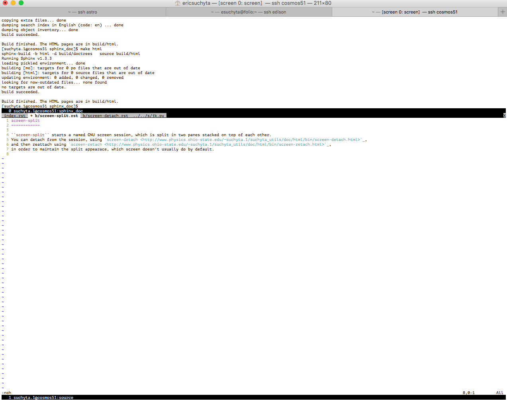

screen-split
============

``screen-split`` starts a named GNU screen session, which is split in two panes stacked on top of each other. 
You can detach from the session, using `screen-detach <http://www.physics.ohio-state.edu/~suchyta.1/suchyta_utils/doc/html/bin/screen-detach.html>`_,
and then reattach using `screen-retach <http://www.physics.ohio-state.edu/~suchyta.1/suchyta_utils/doc/html/bin/screen-retach.html>`_,
in order to maintain the split appearace, which screen doesn't usually do by default. The appearance looks like the image below.
Screen sessions persist even if you log out of your ssh session.

Usage
-----
::

$ screen-split <name>

* name -- The name of the session.

Example
-------
::

$ screen-split test

Image
-----

